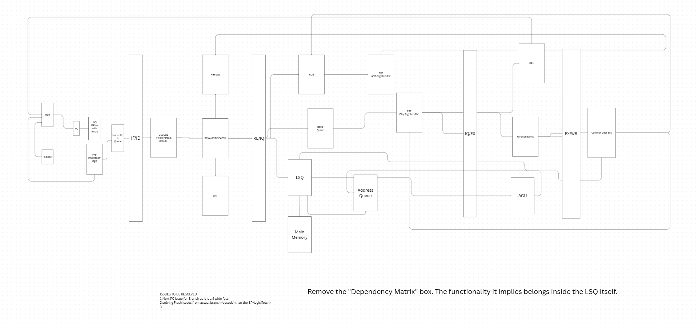

# 🚀 Superscalar 4-Wide Out-of-Order RISC-V Core

[]()
[]()
[]()
[]()

A high-performance, synthesizable **4-wide Superscalar Out-of-Order (OoO) RISC-V Processor** implemented in Verilog. This core is designed for maximum instruction-level parallelism (ILP) using dynamic scheduling, rigorous register renaming, and speculative execution.

---

## 🏛️ Processor Architecture

The core utilizes a decoupled superscalar pipeline based on **Tomasulo's Algorithm** with a hardware Reorder Buffer (ROB) for in-order retirement.



### 🏎️ High-Performance Back-end
*   **4-Wide Dispatch & Commit**: Capable of fetching and retiring up to 4 instructions per cycle.
*   **128-Entry PRF**: Physical Register File managed by a Register Alias Table (RAT) to eliminate **WAW** and **WAR** hazards.
*   **Dynamic Scheduling**: Unified Issue Queue dispatches instructions to execution units as soon as operands are ready.
*   **Memory Disambiguation**: Advanced Load-Store Queue (LSQ) handling out-of-order memory accesses and store-to-load forwarding.

---

## 📊 Live Telemetry Dashboard

The project includes a custom **Architecture Explorer**—a real-time telemetry suite that streams internal hardware state from the FPGA to a web-based dashboard via UART.

### **Dashboard Features:**
*   **ROB Visualizer**: Real-time animation of instruction dispatch, out-of-order execution, and sequential commit.
*   **IPC Analytics**: Live graphing of Instructions Per Cycle (IPC) performance under different code workloads.
*   **Dual-Mode Monitoring**: Switch between "Visualizer Mode" (pedagogical) and "Turbo Mode" (raw 25MHz performance).

---

## 📂 Project Structure

| Folder | Description |
| :--- | :--- |
| `rtl/` | Core Verilog modules (ALU, ROB, PRF, LSQ, BPU, etc.) |
| `dashboard/` | Python Telemetry Server and Web Dashboard source |
| `datapath.png` | Architectural datapath diagram |
| `Makefile` | Synthesis and build automation scripts |

---

## 🛠️ Getting Started (Telemetry Demo)

### **1. Hardware Setup**
*   Synthesize the project using Vivado and flash it to the **Nexys Video FPGA**.
*   Connect the board to your PC via the USB-UART bridge.

### **2. Launch Telemetry Server**
Navigate to the dashboard directory and start the Python bridge:
```bash
cd dashboard
python server.py
```
*(Requires `pyserial` and `websockets`)*

### **3. Open Dashboard**
Open `dashboard/index.html` in your browser to watch the real-time execution of the core.

---

